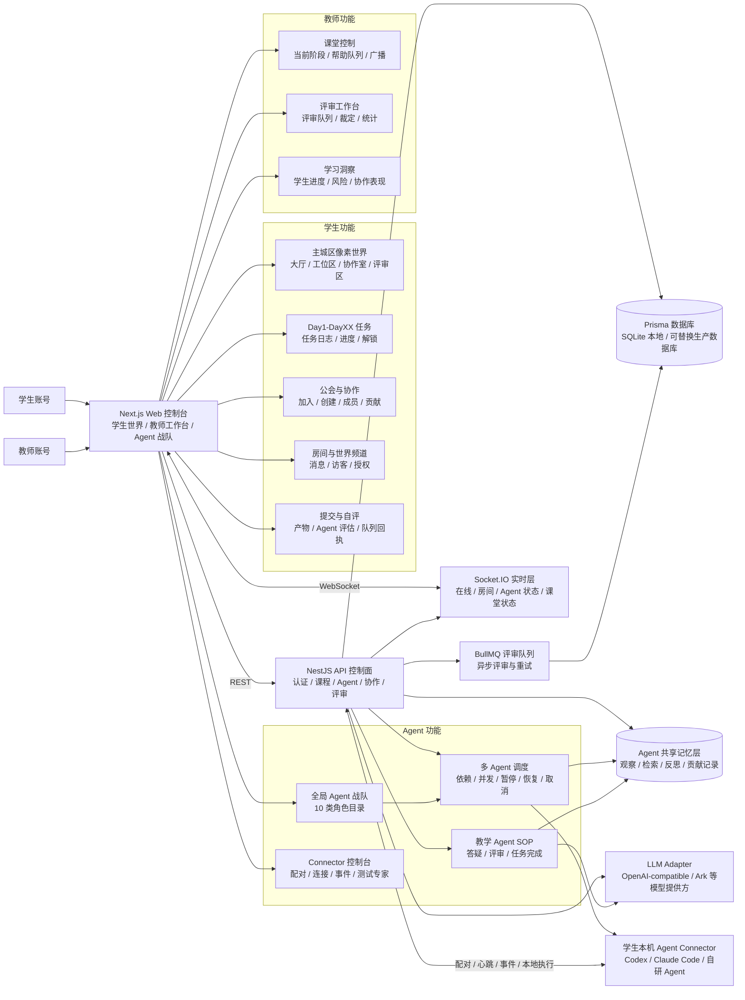
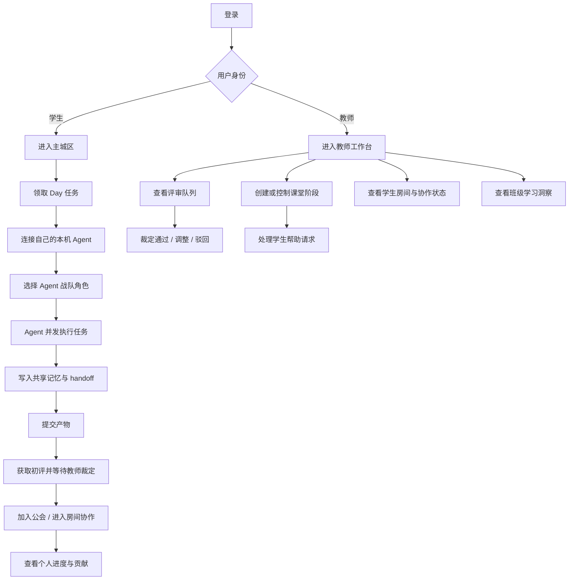
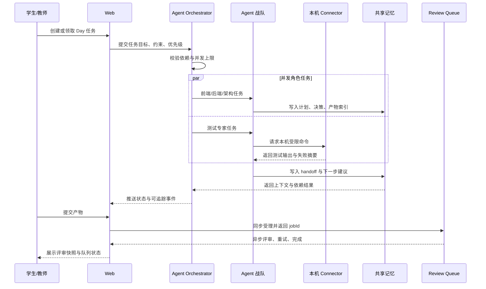
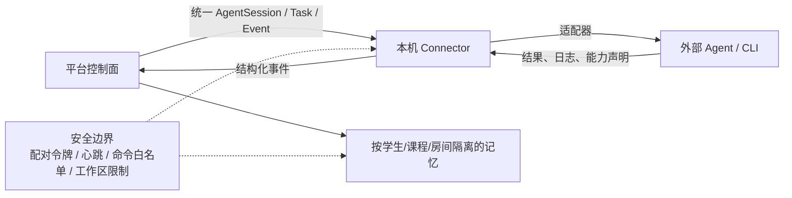
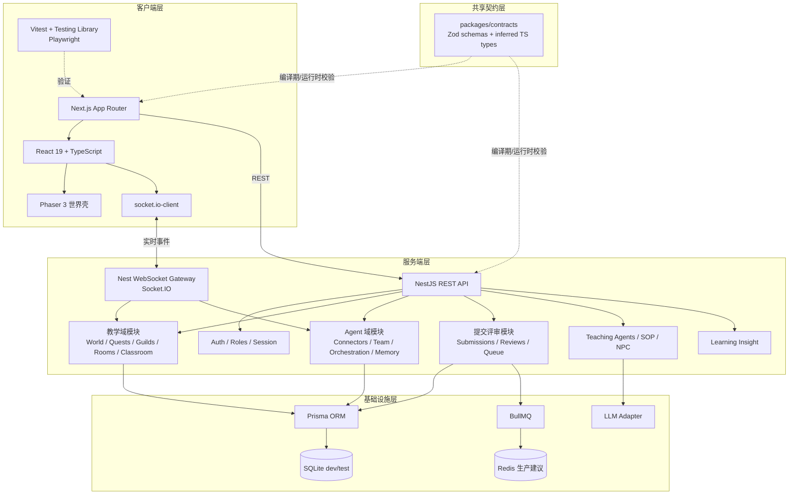
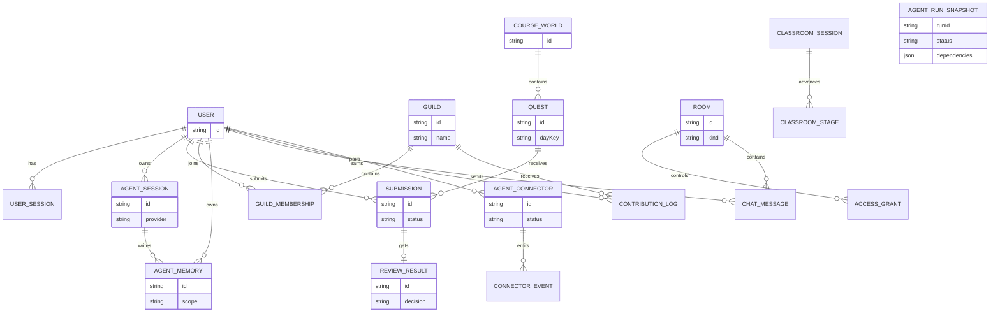
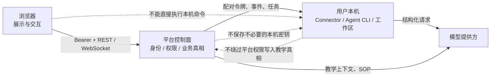

# Agent 教学世界功能图与技术栈

> 版本：2026-07-14  
> 范围：学生端、教师端、Agent 战队、本机 Agent 接入、像素世界、教学业务后端与验证链路。  
> 原则：教学业务是后端真相，像素世界是可视化壳层；Agent 通过统一接口接入，不绑定单一厂商。

## 1. 一图看懂产品

## 2. 功能分层

### 2.1 产品功能地图

| 编号 | 功能域 | 用户能做什么 | 当前实现位置 | 状态 |
|---|---|---|---|---|
| F01 | 登录与会话 | 登录、读取当前身份、退出；区分学生与教师权限 | `apps/web/src/app/login`、`apps/api/src/modules/auth` | 已实现 |
| F02 | 主城区世界 | 进入像素世界，在大厅、工位区、协作室、评审区之间切换 | `apps/web/src/components/world` | 已实现 |
| F03 | 工位区 | 查看 Agent 工位、职业化桌面、坐姿与自动走动状态 | `apps/web/src/components/world/phaser-scene.ts`、`workstation-*` | 已实现，持续精修 |
| F04 | Day 任务 | 查看当前 Day、任务状态、任务日志与解锁进度 | `apps/web/src/components/quests`、`apps/api/src/modules/quests` | 已实现 |
| F05 | Agent 战队 | 查看助教、评审、答疑、测试、架构、前后端、发布和运维角色 | `apps/web/src/app/agent-team`、`apps/api/src/modules/agent-team` | 已实现 |
| F06 | Agent 调度 | 创建任务、设置依赖、并发运行、暂停、恢复、取消并接收事件 | `apps/api/src/modules/agent-orchestration` | 教师派发页面、Nest API、状态机、DAG 与 Prisma 持久化已接通 |
| F07 | 本机 Agent 接入 | 配对本机 Agent，发送心跳、上报事件、受控启动 Codex/Claude CLI | `apps/agent-connector`、`apps/api/src/modules/agent-connectors` | Connector 已通过出站长轮询领取任务、续租、执行并回传真实结果 |
| F08 | Agent 协作 | 角色之间传递任务、产物、状态和 handoff；共享上下文 | `agent-team`、`agent-orchestration`、`memory` | 调度生命周期、持久化和共享契约已实现；跨进程 handoff 传输待补 |
| F09 | 教学 Agent SOP | 自动处理提交评审、学生提问、任务完成等教学流程 | `apps/api/src/modules/teaching-agents` | 已实现 |
| F10 | Agent 记忆 | 记录观察、按范围检索、反思总结，支持学生、课程、房间、Session 与任务上下文 | `apps/api/src/modules/memory` | 多层 scope 的观察、检索与反思已实现 |
| F11 | 公会 | 创建公会、加入公会、查看成员和协作贡献 | `apps/web/src/components/guild`、`apps/api/src/modules/guilds` | 已实现 |
| F12 | 房间与聊天 | 查看房间、发送消息、实时接收消息、邀请协作者、授权与撤销访问 | `apps/web/src/components/chat`、`apps/api/src/modules/chat`、`rooms` | WebSocket 主通道与轮询降级已实现 |
| F13 | 提交 | 学生提交 Day 产物、Agent 评估提示和结构化 artifacts | `apps/api/src/modules/submissions` | 已实现 |
| F14 | 评审 | 获取评审列表、初评、教师裁定、查看个人提交 | `apps/web/src/components/teacher/review-queue.tsx`、`apps/api/src/modules/reviews` | 已实现 |
| F15 | 课堂 | 教师控制阶段，学生查看当前课堂状态并请求帮助 | `apps/web/src/components/classrooms`、`apps/api/src/modules/classrooms` | 已实现基础闭环 |
| F16 | NPC 与世界反馈 | 与 NPC 对话、触发引导、查看在线状态和 Agent 状态 | `apps/web/src/components/world/npc-*`、`apps/api/src/modules/npc`、`realtime` | 已实现基础能力 |
| F17 | 学习洞察 | 查看进度、风险、协作和 Agent 使用情况 | `apps/web/src/components/teacher/insight-*`、`apps/api/src/modules/learning-insight` | 已实现基础读模型 |
| F18 | 实时同步 | 同步在线、房间消息、Agent 状态、课堂状态 | `apps/api/src/modules/realtime`、Web Socket 客户端 | Socket.IO 鉴权、订阅广播与断线轮询降级已实现 |
| F19 | 测试与交付 | 本地测试、构建、E2E、Agent 测试专家执行受限命令 | `apps/agent-connector/src/adapters`、Vitest、Playwright | 已实现基础链路 |

### 2.2 用户路径

## 3. Agent 战队与并发执行

### 3.1 角色目录

| 角色 | 主要职责 | 适配的产品场景 | 当前接入方式 |
|---|---|---|---|
| 助教 Agent | 讲解任务、拆解步骤、提醒下一步 | Day 任务、NPC 引导 | 教学 Agent SOP |
| 评审 Agent | 检查提交质量、生成初评 | 提交后的自动评审 | 教学 Agent SOP + LLM |
| 答疑 Agent | 回答学生问题、关联上下文 | 聊天、课堂帮助 | 教学 Agent SOP + 记忆 |
| 测试专家 Agent | 运行测试、收集失败、反馈结果 | 本地项目验收 | Local Connector Adapter |
| 哲学与设计思维导师 Agent | 澄清目标、发现假设、提出设计问题 | 产品设计与反思 | Agent Team 角色目录 |
| 软件设计架构师 Agent | 拆分模块、定义接口和边界 | 多 Agent 任务规划 | Agent Team + Orchestrator |
| 部署发布专家 Agent | 设计发布流程、环境检查和回滚 | 交付与上线 | Agent Team 角色目录 |
| 前端开发专家 Agent | 页面、交互、可视化实现 | Web 与 Phaser | Agent Team 角色目录 |
| 后端开发专家 Agent | API、数据库、队列与实时服务 | NestJS 后端 | Agent Team 角色目录 |
| 运维架构专家 Agent | 观测、稳定性、容量和故障处理 | 本地与生产运维 | Agent Team 角色目录 |

### 3.2 并发协作流程

下图中的 Orchestrator 到本机 Connector 已采用出站长轮询接通：教师创建任务后，学生 Connector 按学生、Provider 与 capability 领取任务，执行期间续租，完成后保存真实结果；学生确认后才进入提交与评审链路。

### 3.3 接入边界

当前落地原则：服务端不直接替学生机器执行任意 shell；本地命令由 Connector 在受限工作区内通过 `spawn(..., shell: false)` 启动。Codex、Claude 和显式白名单的自研可执行程序已经由统一 Provider adapter 承接，包含超时、取消、输出上限和敏感信息脱敏。Connector 只通过出站请求领取属于当前学生且 Provider/capability 匹配的任务，无需开放学生电脑的入站端口。

## 4. 系统技术架构

### 4.1 技术栈对照表

| 层 | 技术 | 负责内容 | 关键目录 |
|---|---|---|---|
| Monorepo | pnpm workspace | 多应用、共享包、统一脚本 | 根目录 `package.json`、`pnpm-workspace.yaml` |
| Web 框架 | Next.js 15 App Router | 页面、SSR/客户端边界、路由 | `apps/web/src/app` |
| UI | React 19 + TypeScript | 页面与交互组件 | `apps/web/src/components` |
| 世界引擎 | Phaser 3.90 | 像素地图、角色、家具、Tween、HUD | `apps/web/src/components/world` |
| 实时客户端 | Socket.IO Client | 在线、聊天、Agent 状态、课堂状态 | `apps/web/src/lib`、`components/chat`、`classrooms` |
| API 框架 | NestJS 11 | REST、模块化业务、鉴权、WebSocket | `apps/api/src/modules` |
| ORM/数据库 | Prisma 6 + SQLite | 教学世界、提交、评审、记忆、会话持久化 | `apps/api/prisma` |
| 队列 | BullMQ | 评审异步任务、重试、jobId 追踪 | `apps/api/src/modules/queue` |
| 实时服务 | Nest WebSocket + Socket.IO | 房间广播、presence、Agent/课堂状态 | `apps/api/src/modules/realtime` |
| Agent 协议 | Zod + TypeScript | AgentSession、Task、Event、Handoff、能力声明 | `packages/contracts/src` |
| Agent 编排 | NestJS API + 进程内状态机 + Prisma 快照 | 依赖、并发、暂停/恢复/取消、重启恢复和事件 | `apps/api/src/modules/agent-orchestration` |
| 本机执行 | Node.js + `child_process.spawn` | Codex/Claude Provider、程序白名单、工作区限制、超时/取消/脱敏 | `apps/agent-connector/src` |
| 模型适配 | OpenAI-compatible / Ark adapter | 教学 Agent 推理与结构化输出 | `apps/api/src/modules/llm` |
| 认证安全 | Bearer token、bcrypt、Throttler | 登录、session、密码哈希、接口限流 | `apps/api/src/modules/auth` |
| 单元测试 | Vitest | API、Web、contracts、connector 定向测试 | 各 workspace 的 `test` 目录 |
| 组件测试 | Testing Library | Web 页面与 Agent 面板行为 | `apps/web/src/**/*.test.*` |
| E2E | Playwright | 登录、跨页入口和真实浏览器 smoke | `apps/web/e2e` |
| API 测试 | Supertest | HTTP 流程与集成契约 | `apps/api/test` |
| 文档/API | Swagger | API schema 与调试入口 | API Swagger 配置 |

## 5. 核心领域与数据真相

持久化分层：

- **教学真相**：用户、课程、Day 任务、提交、评审、教师裁定、课堂阶段。
- **协作真相**：公会、成员、房间、授权、消息、贡献记录。
- **Agent 真相**：Agent session、Connector、Connector event、Agent memory、Agent role 与运行状态。
- **世界表现**：角色位置、动作、气泡、HUD 和 Phaser 路点只作为展示状态，不替代业务记录。

## 6. API 与前端入口映射

| 业务能力 | 主要接口 | Web 入口 |
|---|---|---|
| 登录态 | `POST /auth/login`、`GET /auth/session`、`POST /auth/logout` | `/login`、页面会话层 |
| 世界概览 | `GET /world` | `/`、主城区 HUD |
| Day 任务 | `GET /quests` | `/`、任务日志、教师 Day 面板 |
| Agent 战队 | `GET /agent-team/catalog`、`GET /agent-team/roles/:roleKey` | `/agent-team`、主城区 `🤖 战队` |
| Agent 调度 | `POST/GET /agent-orchestration/runs`、`GET /agent-orchestration/my-runs`、运行暂停/恢复/取消接口 | 教师工作台、学生 `/agent-team` |
| Agent 接入 | `/agent-connectors/pairing/*`、`/connect`、`/profile`、`/heartbeat`、`/events` | 主城区 Connector 面板、本机 CLI |
| 公会 | `GET/POST /guilds` | `/guilds`、主城区公会入口 |
| 房间/聊天 | `/chat/*`、`/rooms/access-grants/*` | `/chat`、协作室 |
| 提交 | `POST /submissions`、`POST /submissions/from-agent-task` | Day 面板、学生 Agent 任务确认入口 |
| 评审 | `GET /reviews`、`POST /reviews/decide` | `/teacher` |
| 课堂 | classroom REST + Socket.IO 事件 | `/teacher`、学生课堂 banner |
| 记忆 | `/agent-memory/observe`、`retrieve`、`reflect`，支持 course/room/session/task scope | Agent 内部能力，暂不作为独立页面 |
| NPC | NPC conversation endpoints | Phaser NPC 点击与对话 |
| 洞察 | learning insight endpoints | 教师工作台与世界侧状态卡 |

## 7. 技术边界与安全约束

必须保持的边界：

1. API、数据库和教师裁定是教学业务的唯一真相。
2. Phaser 只读取业务状态并负责世界化表达，不在场景中决定评分、权限或任务解锁。
3. Connector 只执行明确允许的本地动作，并通过事件回传结果。
4. 共享记忆按用户、课程、Agent session、房间等 scope 隔离，不能把一个学生的上下文直接暴露给另一个学生。
5. 模型提供方通过 adapter 接入，平台内部使用统一 Agent 协议，避免绑定 Codex、Claude Code 或单一模型供应商。

## 8. 本地运行与验收

| 用途 | 命令/地址 |
|---|---|
| Web 开发 | `pnpm dev:web`，默认 `http://localhost:3000` |
| API 开发 | `pnpm dev:api`，默认 `http://localhost:3001` |
| E2E Web | Playwright 自拉起 `http://localhost:3100` |
| 全量测试 | `pnpm test` |
| Web 定向测试 | `pnpm --filter web exec vitest run src/components/world` |
| API 构建 | `pnpm --filter api build` |
| Web 构建 | `pnpm --filter web build` |
| Connector 测试 | `pnpm --filter agent-connector test` |
| Connector 构建 | `pnpm --filter agent-connector build` |
| E2E | `pnpm test:e2e` |
| 根构建 | `pnpm build`，已配置 workspace 顺序构建 |

## 9. 当前状态与下一阶段

### 已经具备

- 学生、教师、Agent 三类入口和认证边界。
- 主城区像素世界与四个区域的世界壳。
- Day 任务、提交、评审、课堂、公会、聊天、房间授权的基础闭环。
- 十类 Agent 战队目录、教师受控的编排 API、并发状态机和 Prisma 运行快照。
- 本机 Connector 配对、心跳、事件上报，以及带超时、取消、输出上限与脱敏的 Codex/Claude 进程适配器。
- 按学生、课程、房间、Agent session、任务组合隔离的 Agent memory。
- 房间级 WebSocket 消息主通道、断线轮询降级、教学 Agent SOP 和学习洞察基础能力。
- contracts workspace 作为前后端共享 schema 边界。

### 下一阶段建议

1. **深化 Agent 任务证据与 handoff**：在现有任务领取、续租、结果回传和学生确认提交之上，补齐代码 diff、测试报告、产物索引和跨角色 handoff 审计。
2. **把 Connector 安全策略产品化**：每个学生配置工作区、程序白名单、资源上限和审批策略；自研 Provider 必须显式加入白名单。
3. **补齐 Agent-to-Agent 跨进程协作协议**：统一 `task.created`、`task.started`、`task.blocked`、`handoff.created`、`artifact.created`、`run.completed` 事件及其持久化审计。
4. **为记忆 scope 增加业务归属校验**：当前数据库已支持多层精确过滤，下一步应校验 course、room、session、task 是否确实属于当前学生可访问范围。
5. **优先修复基线测试噪音后再扩 E2E**：当前仓库仍有历史 API 套件和 Phaser 浏览器环境问题，先分离环境失败与业务失败，再覆盖完整 Agent 协作链路。
6. **教学闭环优先于世界扩张**：先让 Day 任务、Agent 执行、提交、评审、教师裁定可追踪，再继续扩大厅、家具和角色动画。

这张图的核心结论是：产品不是“把多个聊天机器人放进像素地图”，而是一个由 **教学控制面 + Agent 协作平面 + 本机执行面 + 像素世界展示面** 组成的系统。四个平面通过共享契约和事件连接，但权限、评分、提交与课程进度必须留在教学控制面。
