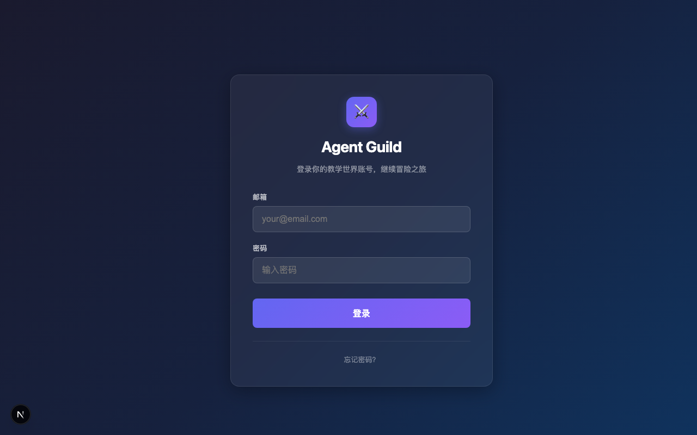
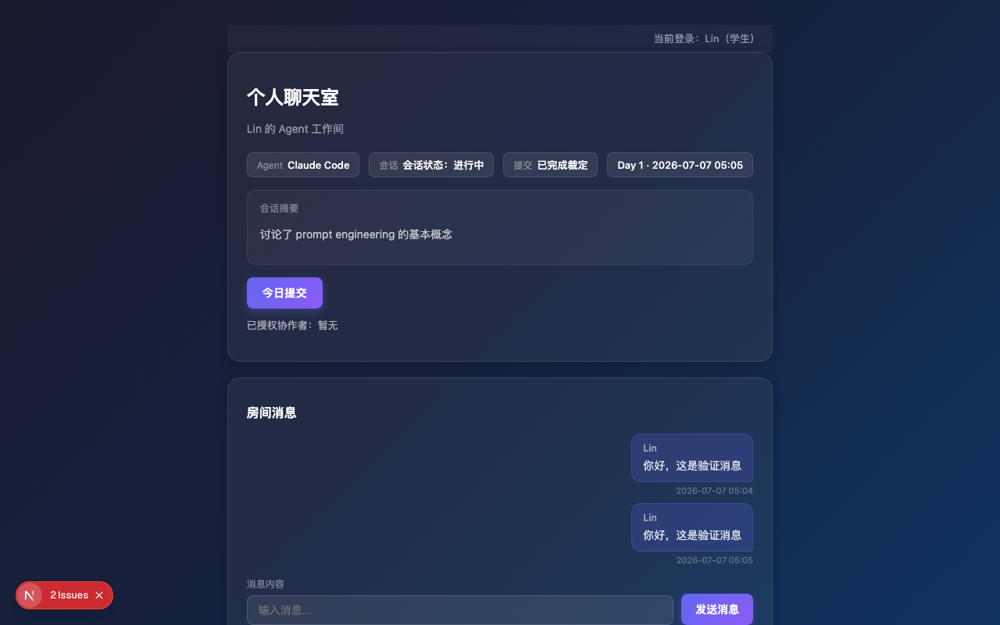
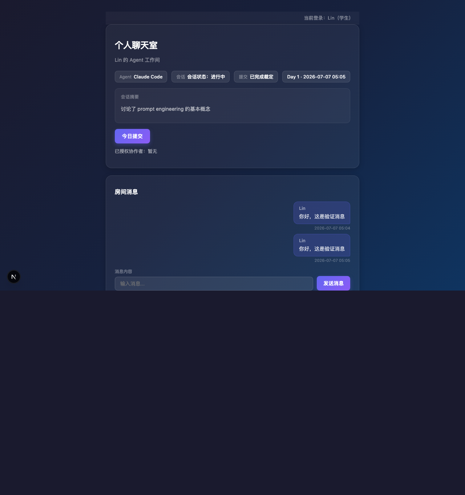
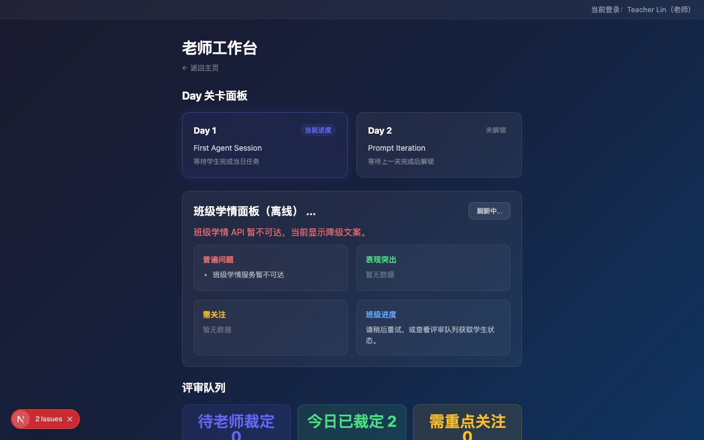

# Agent Guild — 使用说明

## 简介

Agent Guild 是一个**面向教学场景的像素风 Web 端 RPG Agent 世界**。

产品目标：把学生学习和使用 Agent、构建系统、协作互测这件事**游戏化**——学生在像素世界中组建公会、完成每日任务、与 AI Agent 对话、提交作业并互相评审，教师则通过工作台实时掌握班级学情并参与评审决策。

---

## 快速开始

### 环境要求

- **Node.js** 24+
- **pnpm** 9+
- **Redis**（可选，用于评审队列 BullMQ）
- **火山引擎豆包 API Key**（可选，用于 AI 智能功能）

### 安装与启动

```bash
# 1. 安装依赖
pnpm install

# 2. 配置 AI 模型（可选，启用 NPC 对话、智能评审等功能）
#    编辑 apps/api/.env，填入火山引擎豆包 API Key：
#    ARK_API_KEY=your-ark-api-key
#    ARK_BASE_URL=https://ark.cn-beijing.volces.com/api/v3
#    ARK_MODEL=doubao-seed-2-1-turbo-260628

# 3. 初始化数据库（SQLite）
cd apps/api && npx prisma db push && npx prisma db seed && cd ../..

# 4. 启动开发服务（两个终端）
pnpm dev:web   # Web 前端 → http://localhost:3000
pnpm dev:api   # API 服务 → http://localhost:3001
```

> **提示**：不配置 AI 模型也可正常运行，AI 相关功能会自动降级为预设回复。

访问 **http://localhost:3000** 即可进入。

### 测试账号

| 角色 | 邮箱 | 密码 |
|------|------|------|
| 学生 Lin | lin@academy.test | student-pass-123 |
| 学生 Mo | mo@academy.test | student-pass-123 |
| 学生 Kai | kai@academy.test | student-pass-123 |
| 教师 | teacher@academy.test | teacher-pass-123 |

---

## 功能页面

### 1. 登录



打开首页会自动跳转到登录页。输入邮箱和密码后点击登录，成功后跳转到主城区主页。

- 学生登录后进入**主城区**，可以看到自己的公会、任务和像素世界入口
- 教师登录后进入**教师工作台**，查看班级学情和评审队列

### 2. 主城区（主页）



主页是学生的核心导航页面，展示以下信息：

- **当前 Day**：显示当前开放的每日任务（如 "Day 1: First Agent Session"）及任务状态
- **公会信息**：所属公会名称、成员数、协作积分
- **像素世界入口**：进入 Phaser 像素风地图场景
- **导航链接**：快速跳转到聊天室、公会大厅等功能页

### 3. 个人聊天室



每位学生拥有一个个人聊天室，核心功能包括：

- **与 Agent 对话**：在聊天框中发送消息，AI Agent 会基于上下文生成回复
- **查看会话状态**：显示当前 Agent Session 的状态（active / completed）
- **提交作业**：点击「今日提交」按钮，将当日学习成果（对话摘要、工作总结、代码产物、自我反思）提交到评审队列
- **授权协作者**：可以将聊天室摘要授权给其他同学，方便互评时查看上下文
- **消息收发**：消息以时间线形式展示，支持自动刷新轮询获取新消息

### 4. 公会大厅


公会大厅展示所有公会列表，包含：

- 公会名称与描述
- 成员数量与角色（leader / member / visitor）
- 协作积分（Collaboration Points）
- 成员在线状态

公会鼓励学生协作完成任务、互评作业，通过贡献获得协作积分。

### 5. 教师工作台



教师登录后进入工作台，包含三大面板：

**Day 关卡面板**
- 展示每日任务的标题、状态（open / locked / completed）
- 当前进度一目了然，未解锁的 Day 灰色显示

**班级学情面板**
- 班级整体进度统计
- 标记表现突出和需要关注的学生
- 汇总普遍存在的问题

**评审队列**
- 统计卡片：待评审数量、已完成数量、平均分数
- 评审列表：每条提交显示学生姓名、提交时间、AI 预审分数
- 操作按钮：教师可查看 AI 评审意见后做出最终决策（approve / reject）
- 学生房间链接：可直接跳转到对应学生的聊天室查看完整对话上下文

---

## AI 智能功能

项目接入了**火山引擎豆包**大模型（Doubao-Seed-2.1-Turbo），提供 4 项 AI 能力：

| 功能 | 说明 |
|------|------|
| **NPC 对话** | 像素世界中的 NPC（如前台接待）通过 LLM 生成有人格特征的智能对话 |
| **学习洞察** | 基于学生提交和记忆流数据，AI 生成个人学习分析和班级学情报告 |
| **记忆评分与反思** | 学生的每次学习记录被存储为记忆条目，累计重要性超阈值时触发 LLM 生成深度反思 |
| **教学 SOP 评审** | AI 对学生提交进行自动化预审，生成评分和改进建议供教师参考 |

**AI 未配置时的降级行为**：当 `ARK_API_KEY` 等环境变量未配置时，所有 AI 功能会优雅降级——NPC 返回预设对话，评审返回默认分数，学习洞察返回基础统计，不影响核心流程的正常使用。

环境变量配置（`apps/api/.env`）：

```env
# 火山引擎豆包（默认）
ARK_API_KEY=your-ark-api-key
ARK_BASE_URL=https://ark.cn-beijing.volces.com/api/v3
ARK_MODEL=doubao-seed-2-1-turbo-260628

# 也可切换为通义千问等其他 OpenAI 兼容模型
# ARK_API_KEY=your-dashscope-api-key
# ARK_BASE_URL=https://dashscope.aliyuncs.com/compatible-mode/v1
# ARK_MODEL=qwen-plus
```

---

## 验证脚本

项目提供了双账号 API 全链路验证脚本：

```bash
npx tsx scripts/verify-dual-account.ts
```

脚本覆盖 **13 个验证场景**：

| # | 场景 | 验证内容 |
|---|------|----------|
| 1 | 健康检查 | `GET /health` 返回 200 |
| 2 | 三角色登录 | Lin / Mo / Teacher 分别登录获取 token |
| 3 | Session 验证 | 登录后 `GET /auth/session` 返回正确用户信息 |
| 4 | 世界观查询 | `/world`、`/quests`、`/guilds` 接口正常 |
| 5 | 提交与评审全链路 | 学生提交 → AI 评审 → 教师决策 |
| 6 | 聊天消息 | 消息收发功能 |
| 7 | 房间授权 | 授权 → 查询可访问房间 → 撤销授权 |
| 8 | Agent 记忆隔离 | 记忆写入、自己查询、他人查询被拒（403） |
| 9 | NPC 对话 | NPC 智能对话接口 |
| 10 | Agent 虚拟形象 | 虚拟形象查询接口 |
| 11 | 学习洞察 | 教师查班级/学生洞察、学生查自己、他人查询被拒 |
| 12 | 教学 Agent SOP | 提问、任务完成、多 Agent 协作接口 |
| 13 | 权限隔离 | 学生访问教师接口被拒（403） |

---

## 技术架构

### 技术栈

| 层 | 技术 |
|----|------|
| 前端 | Next.js 15 + React 19 + Phaser 3.90（像素引擎） |
| 后端 | NestJS 11 + Prisma 6（ORM）+ BullMQ 5（队列） |
| 契约 | Zod 3（前后端共享类型校验） |
| 数据库 | SQLite（开发）/ PostgreSQL（生产） |
| AI | 火山引擎豆包（Doubao-Seed-2.1-Turbo），兼容其他 OpenAI 协议模型 |

### 项目结构

```
game-system-two/
├── apps/
│   ├── web/          # Next.js + Phaser 前端（端口 3000）
│   ├── api/          # NestJS 后端（端口 3001）
│   └── agent-connector/ # 本机 Agent 接入
├── packages/
│   └── contracts/    # Zod 共享契约（前后端共用）
├── scripts/          # 验证与工具脚本
├── docs/             # 产品、架构、指南与设计计划
└── artifacts/        # 验收截图与视觉过程产物
```

---

## 常见问题

### 端口冲突

如果 3000 或 3001 端口被占用：

```bash
# 查找占用端口的进程
lsof -i :3000
lsof -i :3001

# 杀掉对应进程后重新启动
pnpm dev:web
pnpm dev:api
```

### 数据库初始化

```bash
cd apps/api

# 重置数据库（会清除所有数据）
npx prisma db push --force-reset

# 重新推送 Schema
npx prisma db push

# 填充种子数据
npx prisma db seed
```

### AI 功能未生效

1. 检查 `apps/api/.env` 中是否配置了 `ARK_API_KEY`
2. 确认 `ARK_BASE_URL` 和 `ARK_MODEL` 值正确
3. 重启 API 服务使配置生效
4. 未配置时系统会自动降级，不影响基础功能使用
